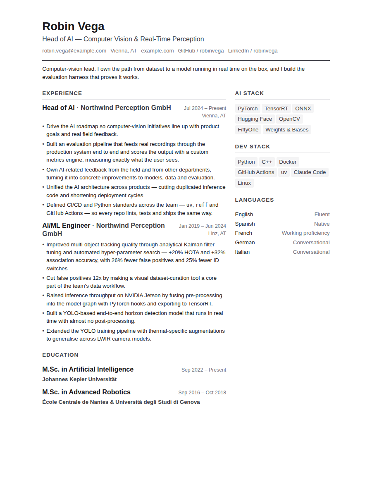
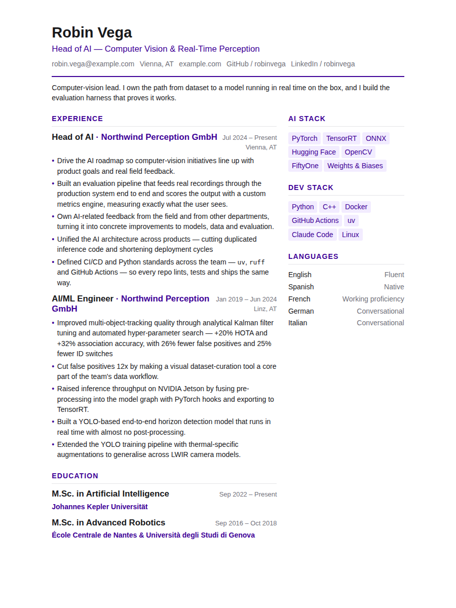

# vita

**CV as code.** Write every bullet once, tag it, then compose a job-tailored CV
by selecting tags. Composition is a deterministic tag query — not an LLM
rewrite — so the same inputs always produce the same PDF.

Content compiles to a standard [JSON Resume](https://jsonresume.org)
`resume.json`, which a vendored theme renders to HTML and PDF. Because the
interchange format is standard, the renderer is swappable.



## Why

Maintaining one CV per role means the same bullet drifts into four slightly
different wordings, and the good version is in whichever file you edited last.
Here there is one copy of each bullet. A CV variant is a query over them.

```
content/*.yaml  ──┐
                  ├──▶  compose  ──▶  resume.json  ──▶  HTML  ──▶  PDF
profiles/x.yaml ──┘    (tag query)   (JSON Resume)    (theme/)  (Playwright)
```

## Quick start

```bash
pnpm install
pnpm exec playwright install chromium   # once, for PDF export

pnpm vita build ml-lead                 # → build/ml-lead/{resume.json,index.html,ml-lead.pdf}
pnpm vita dev ml-lead                   # watch + live-reloading preview on :4321
pnpm vita tags                          # every tag, with usage counts
pnpm vita lint                          # validate content and profiles
```

Useful flags:

```bash
pnpm vita build ml-lead --no-pdf        # skip the slow step while iterating
pnpm vita build ml-lead --screenshot    # also write a full-page PNG
pnpm vita dev ml-lead --port 8080
pnpm vita --content ./mine build ml-lead
```

## Writing content

Everything under `content/` is one store; files are merged in filename order,
so split it however you like. Each entry carries `tags` and an optional
`priority`; both drive composition and neither reaches `resume.json`.

```yaml
work:
  - name: Northwind Perception GmbH
    position: Head of AI
    startDate: '2024-07' # omit endDate for an ongoing role
    tags: [leadership, ml]
    priority: 100
    highlights:
      - text: Improved multi-object-tracking quality through Kalman filter tuning
        metrics: +20% HOTA, 26% fewer false positives
        tags: [ml, cv, tracking]
        priority: 100
```

| Field      | Meaning                                                              |
| ---------- | -------------------------------------------------------------------- |
| `text`     | The bullet. Inline Markdown works (`**bold**`, `` `code` ``, links). |
| `tags`     | What profiles select on. Lowercase-kebab by convention.              |
| `priority` | Higher sorts earlier. Defaults to `0`.                               |
| `metrics`  | Quantified outcome, folded into the text as ` — …` at compose time.  |
| `date`     | Optional ISO date the bullet refers to.                              |

Schemas are strict: an unknown key is an error, not a silent drop. Run
`pnpm vita lint` after editing.

## Writing a profile

A profile is the tag query for one variant.

```yaml
name: ML Lead

include: [leadership, ml, cv, mlops, embedded, data] # keep entries with ≥1 of these
exclude: [early-career, soft] # drop these, even if included
order: [leadership, ml, cv] # tie-break between equal priorities
max_per_section: 6 # cap jobs / degrees / skill groups
max_highlights: 5 # cap bullets per job
sections: [work, education, skills, languages] # output order; omitted are dropped

basics: # tailor the headline per variant
  label: Head of AI — Computer Vision
```

Composition rules, in order:

1. **Filter.** Keep an entry with at least one `include` tag; an empty
   `include` keeps everything. Drop anything carrying an `exclude` tag —
   exclude always wins.
2. **Containers.** A job, degree or skill group also survives `include` if any
   of its bullets match, so you tag bullets and the job comes along. `exclude`
   is not softened: excluding a job drops it whole.
3. **Sort.** `priority` descending, then `order` tag rank, then date
   descending, then document order. The sort is total, so output is stable.
4. **Cap.** `max_per_section`, then `max_highlights`.
5. **Strip.** `tags`, `priority` and `metrics` are removed; what is left is
   valid JSON Resume.

## Make it yours

The brand lives in exactly one file: **`theme/tokens.json`**. Every nested key
becomes a CSS custom property (`color.accent` → `--color-accent`) that
`theme/style.css` reads. Neither the stylesheet nor the template contains a
literal colour, font or brand size — a test enforces that — so editing tokens
is the whole customisation story.

Change the accent and the type size:

```jsonc
{
  "color": {
    "accent": "#3E0097", // headings, rules, bullet markers
    "link": "#3E0097",
  },
  "font": {
    "size-base": "10.5pt", // everything else scales from this
  },
  "tag": {
    "background": "#f2ecff",
    "color": "#3E0097",
  },
}
```

Rebuild, and the same content looks like this:



Worth knowing:

- `font.scale-ratio` drives the whole type scale; `font.size-base` drives
  absolute size. Adjust those two before touching anything else.
- `page.main-width` / `page.sidebar-width` are grid fractions — set the sidebar
  to `0fr` for a single-column CV.
- Fonts are referenced by family name, not downloaded. Rendering is offline by
  design, so name families the render machine has installed.

For structural changes, edit `theme/template.hbs` — it is vendored Handlebars,
not an npm dependency, so it is yours to rewrite. See `theme/README.md`.

## Layout

```
content/         source of truth, tagged
profiles/        one YAML per CV variant
theme/           vendored renderer: tokens.json, template.hbs, style.css
src/
  schema.ts      zod models for content and profiles
  compose.ts     content + profile -> resume.json
  render.ts      resume.json -> HTML -> PDF
  lint.ts        orphan tags, empty profiles, untagged bullets
  cli.ts         thin command layer
tests/           unit tests + a golden resume.json
build/           generated output (gitignored)
```

## Development

```bash
pnpm lint        # eslint + prettier
pnpm typecheck
pnpm test        # vitest
pnpm coverage    # vitest + thresholds
pnpm knip        # unused files, exports and dependencies
```

`pnpm install` installs [lefthook](https://lefthook.dev) git hooks. On commit
they run ESLint and Prettier over the staged files (fixing in place), validate
`content/` and `profiles/` when you touch them, and check the commit message
against [Conventional Commits](https://www.conventionalcommits.org). Everything
slower — typecheck, tests, coverage, knip, the PDF build — runs in CI, not in
the way of a commit. Use `git commit --no-verify` to skip once.

Coverage thresholds live in `vitest.config.ts` and fail `pnpm coverage`
locally and in CI. Codecov is advisory: it comments on the diff but does not
gate the merge, since vitest already did.

`tests/__golden__/ml-lead.resume.json` pins the sample profile's output. If a
change to composition is intentional, refresh it deliberately and read the
diff:

```bash
UPDATE_GOLDEN=1 pnpm test
git diff tests/__golden__
```

## Not in scope

Single-user, CV-as-code. No AI tailoring, no hosted service, no GUI editor, no
cover letters, no LinkedIn import, no theme gallery.

## Licence

MIT. The theme's layout derives from the
[`even`](https://github.com/rbardini/jsonresume-theme-even) JSON Resume theme
by Rafael Bardini (MIT) — see `theme/NOTICE`.
